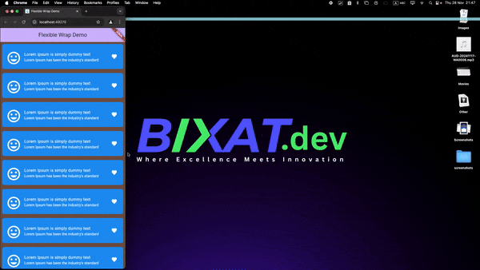

# FlexibleWrap

FlexibleWrap is a Flutter package designed to provide a flexible and customizable way to arrange widgets in a wrap layout. It allows developers to create dynamic layouts where widgets can wrap onto the next line based on available space, similar to how items behave in a shopping cart or a list of cards.

## Showcase



## Features

- **Customizable Layout**: Easily customize the layout of your widgets with various parameters such as direction, alignment, spacing, and more.
- **Dynamic Wrapping**: Automatically wraps widgets onto the next line based on the available space, ensuring optimal use of screen real estate.
- **Responsive Design**: Supports both horizontal and vertical directions, making it suitable for a wide range of applications.
- **Flexible Spacing**: Adjusts spacing between items and runs to achieve the desired visual appearance.

## Getting Started

To get started with FlexibleWrap, add it to your `pubspec.yaml` file:

```yaml
dependencies:
  flexible_wrap: ^latest_version
```

Replace `^latest_version` with the current version of the package.

Then, import it in your Dart file:

```dart
import 'package:flexible_wrap/flexible_wrap.dart';
```

## Usage

Here's a basic example of how to use FlexibleWrap:

```dart
FlexibleWrap(
  length: 10, // Number of children to display
  builder: (int index, double itemExtraWidth) {
    return Container(
      color: Colors.blue,
      width: 100.0 + itemExtraWidth, // Adjust width based on extra width
      child: Text('Item $index'),
    );
  },
  itemWidth: 100.0, // Width of each item
  direction: Axis.horizontal, // Direction to arrange the children
  alignment: WrapAlignment.start, // Alignment of children within a run
  spacing: 8.0, // Spacing between children in the main axis
)
```

## Customization

FlexibleWrap offers several customization options to tailor the layout to your needs:

- **Direction**: Specify whether the children should be arranged horizontally (`Axis.horizontal`) or vertically (`Axis.vertical`).
- **Alignment**: Set how the children within a run should be placed along the main axis (`WrapAlignment.start`, `end`, `center`, etc.).
- **Spacing**: Define the amount of spacing between the children in the main axis.
- **Run Alignment**: Determine how the runs themselves should be placed in the cross axis (`WrapAlignment.start`, `end`, `center`, etc.).
- **Cross Axis Alignment**: Align the children within a run relative to each other in the cross axis (`WrapCrossAlignment.start`, `end`, `center`, etc.).

## Contributing

Contributions to FlexibleWrap are welcome! Please feel free to submit pull requests or open issues for bugs and feature requests.

## License

FlexibleWrap is licensed under the MIT License. See the LICENSE file for details.

